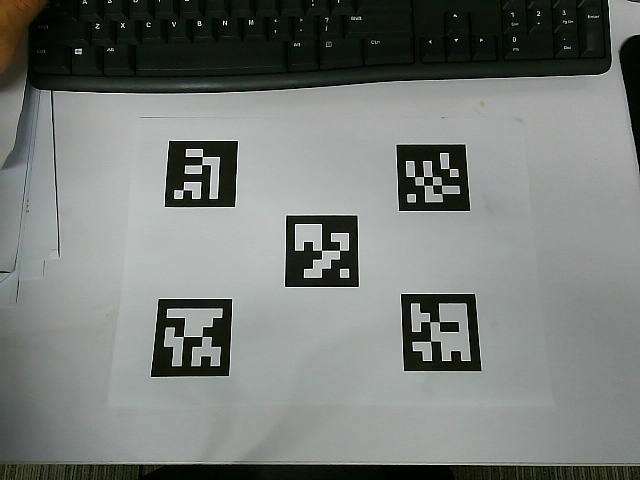
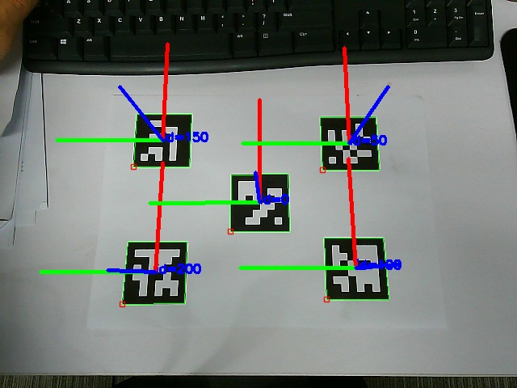

# Aruco Marker 功能包

### 依赖

- [OpenCV](https://github.com/opencv/opencv)

### 编译

```
​```
git clone https://github.com/chennuo0125-HIT/opencv_demo.git
cd aruco
mkdir build
cd build
cmake ..
make
```

### 生成marker

```
../bin/generate_marker 6X6_250 0 50 100 150 200
```

"6X6_250"指的是字典名，表示生成一个拥有250个6X6 marker的字典

"0 50 100 150 200"marker的id号，需要生成几个marker就在后面写几个id

### 普通相机位姿估计

```
../bin/estimate_pose 6X6_250 ../config/param.yaml ../data/test.jpg
```

"param.yaml"配置文件，包含相机内参和实际打印出来的marker的边长

"test.jpg"测试照片

结果:





### 鱼眼相机位姿估计

```
../bin/estimate_pose 6X6_250 ../config/fisheye_param.yaml ../data/test_fisheye.jpg
```

"fisheye_param.yaml"配置文件，包含鱼眼相机内参和实际打印出来的marker的边长

"test_fisheye.jpg"测试照片

结果:


