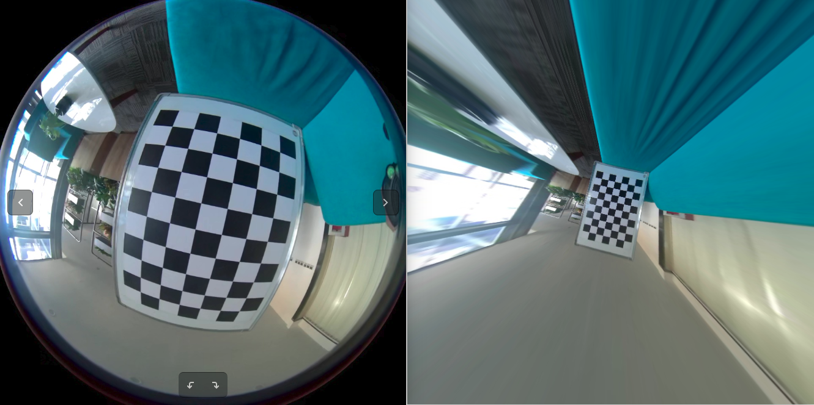

# calibrate node

### 依赖

- [OpenCV](https://github.com/opencv/opencv)

### 编译

```
​```
git clone https://github.com/chennuo0125-HIT/opencv_demo.git
cd calibrate
mkdir build
cd build
cmake ..
make
```

### 标定

```
../bin/calibrator ../config/param.yaml
```

结果保存在 "out_camera_data.xml"文件中

### 配置文件解释

```
<?xml version="1.0"?>
<opencv_storage>
<Settings>
  <!-- 标定板尺寸 -->
  <BoardSize_Width> 9</BoardSize_Width>
  <BoardSize_Height>6</BoardSize_Height>
  
  <!-- 标定板栅格大小(单位mm) -->
  <Square_Size>70</Square_Size>
  
  <!-- 标定板类型(默认选择棋盘格) -->
  <Calibrate_Pattern>"CHESSBOARD"</Calibrate_Pattern>
  
  <!-- 输入数据源
  	如果选择相机在线标定，直接将下面的Input参数置为"相机id"
  	如果选择输入视频进行标定，Input参数置为视频路径"video.mp4"
  	如果选择抓拍的图片集进行标新，则Input参数设置为相片集路径配置文件(如下面默认配置所示)
  	-->
  <Input>"/home/cn/learn/opencv_demo/calibrate/config/img_path.xml"</Input>
  
  <!--  If true (non-zero) we flip the input images around the horizontal axis.-->
  <Input_FlipAroundHorizontalAxis>0</Input_FlipAroundHorizontalAxis>
  
  <!-- Time delay between frames in case of camera. -->
  <Input_Delay>100</Input_Delay>	
  
  <!-- How many frames to use, for calibration. -->
  <Calibrate_NrOfFrameToUse>11</Calibrate_NrOfFrameToUse>
  <!-- Consider only fy as a free parameter, the ratio fx/fy stays the same as in the input cameraMatrix. 
	   Use or not setting. 0 - False Non-Zero - True-->
  <Calibrate_FixAspectRatio> 1 </Calibrate_FixAspectRatio>
  <!-- If true (non-zero) tangential distortion coefficients  are set to zeros and stay zero.-->
  <Calibrate_AssumeZeroTangentialDistortion>1</Calibrate_AssumeZeroTangentialDistortion>
  <!-- If true (non-zero) the principal point is not changed during the global optimization.-->
  <Calibrate_FixPrincipalPointAtTheCenter> 1 </Calibrate_FixPrincipalPointAtTheCenter>
  
  <!-- The name of the output log file. -->
  <Write_outputFileName>"out_camera_data.xml"</Write_outputFileName>
  <!-- If true (non-zero) we write to the output file the feature points.-->
  <Write_DetectedFeaturePoints>1</Write_DetectedFeaturePoints>
  <!-- If true (non-zero) we write to the output file the extrinsic camera parameters.-->
  <Write_extrinsicParameters>1</Write_extrinsicParameters>
  <!-- If true (non-zero) we show after calibration the undistorted images.-->
  <Show_UndistortedImage>1</Show_UndistortedImage>
  
  <!-- 是否使用鱼眼模型进行标定，如果是鱼眼相机的标定，此处一定要设置为1，否则标定结果很烂 -->
  <Calibrate_UseFisheyeModel>0</Calibrate_UseFisheyeModel>
  <!-- If true (non-zero) distortion coefficient k1 will be equals to zero.-->
  <Fix_K1>0</Fix_K1>
  <!-- If true (non-zero) distortion coefficient k2 will be equals to zero.-->
  <Fix_K2>0</Fix_K2>
  <!-- If true (non-zero) distortion coefficient k3 will be equals to zero.-->
  <Fix_K3>0</Fix_K3>
  <!-- If true (non-zero) distortion coefficient k4 will be equals to zero.-->
  <Fix_K4>1</Fix_K4>
  <!-- If true (non-zero) distortion coefficient k5 will be equals to zero.-->
  <Fix_K5>1</Fix_K5>
</Settings>
</opencv_storage>

```

注: 以上用中文注释的参数需要了解并根据需求配置之外，其它参数可以使用默认的．

### 标定结果

