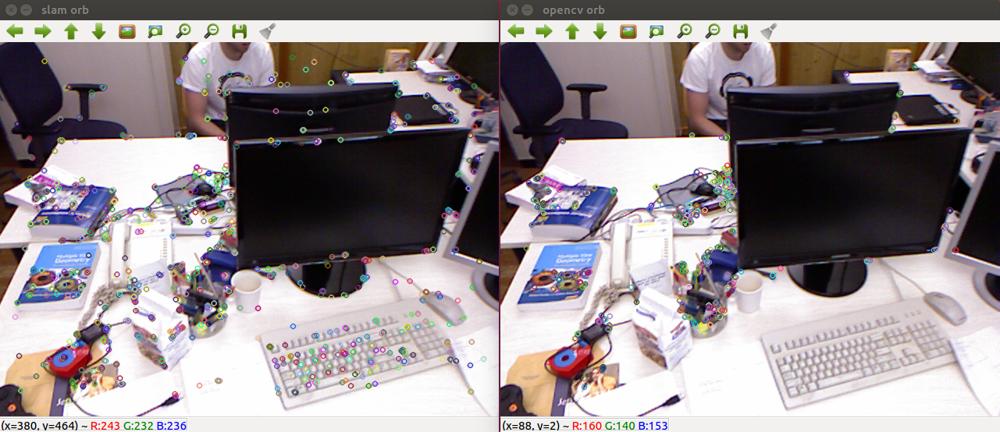

# orb_compare
### 功能
测试orb_slam2和opencv中的orb特征提取器的功能差异
### 编译
```
git clone https://github.com/chennuo0125-HIT/opencv_demo.git
cd orb_compare && mkdir build
cd build
cmake ..
make
```
### 运行
```
../bin/orb_compare ../data/test.png
```
### 结果
